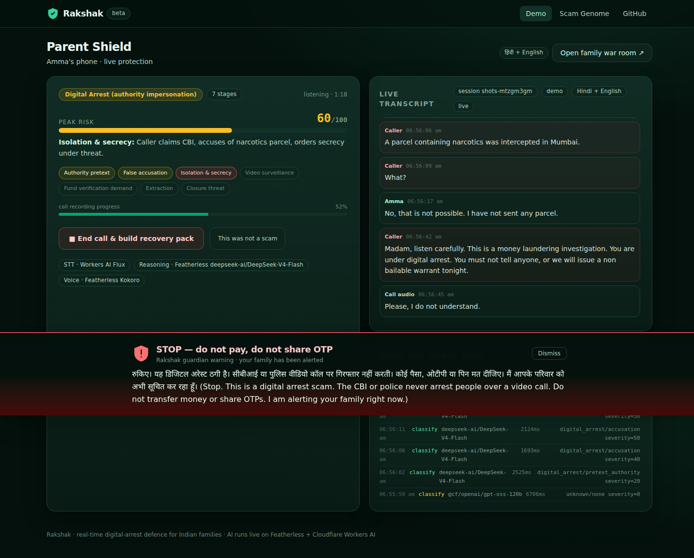
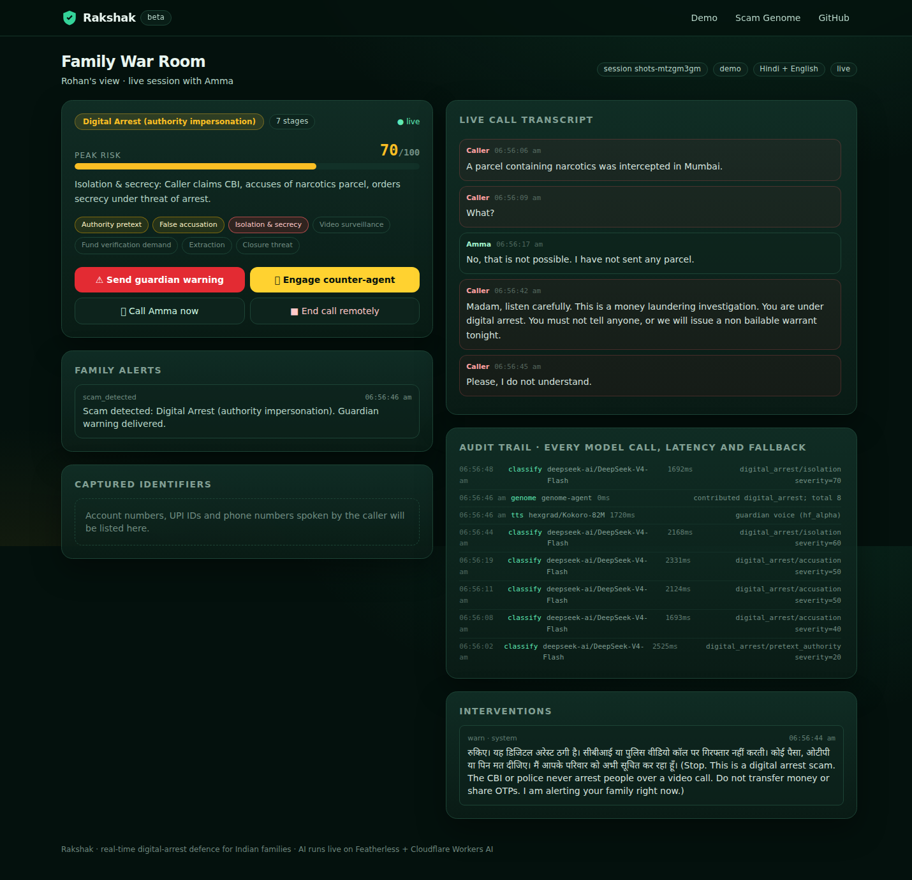
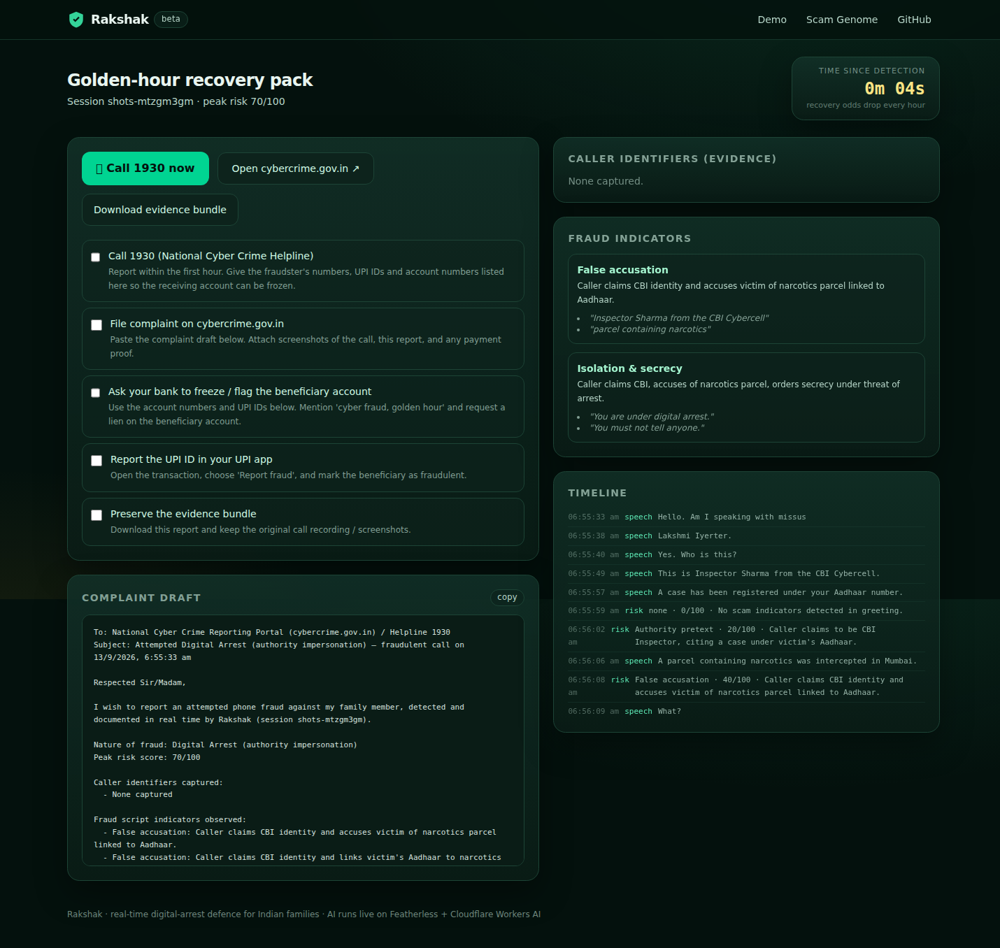

# Rakshak 🛡️

**Blocklists stop numbers. Rakshak understands the script — and fights back.**

Rakshak is a real-time AI defence layer for phone fraud against Indian families. It listens
alongside the person being targeted, recognises the *digital-arrest* playbook as it unfolds,
warns them out loud in Hindi or English, alerts the family while the call is still happening,
baits the scammer with a counter-agent to expose their payment rails, and turns every call into
a filing-ready complaint pack.

- **Live demo:** https://rakshak.kiter0211.workers.dev
- **Demo video:** [assets/rakshak-demo.mp4](assets/rakshak-demo.mp4)
- **Slides:** [assets/rakshak-slides.pdf](assets/rakshak-slides.pdf)
- Built for the **BunnieX Hackathon 2026** (TechieBunnies).



<p align="center">
  
  
</p>

---

## 1. Project Title & Description

**Rakshak** (रक्षक, "protector") is a real-time AI guardian for phone calls. It runs quietly during
a call, understands the conversation, and acts **inside the call** instead of relying on caller ID:

- it tracks which stage of the known scam script the caller is in,
- warns the victim out loud before money moves,
- alerts the family with a live transcript and one-tap interventions,
- deploys a counter-agent that stalls the scammer and captures their payment identifiers,
- and compresses the "golden hour" after a fraud attempt into an evidence pack and complaint draft.

## 2. Problem Statement

| Fact | Source |
| --- | --- |
| Indians lost **₹22,495 crore** to cyber fraud in 2025; ₹52,976 crore over six years | NHRC / I4C reporting (2026) |
| **297,727** digital-arrest complaints between 2022 and May 2026, ₹4,057 crore lost | Government data reported by News18 (Jul 2026) |
| Recovery after money leaves is **2–13%** — speed is the only real defence | Karnataka Home Dept / cybercrime reporting |
| **3–5 seconds** of public audio is enough to clone a family member's voice | 2026 reporting on AI voice-cloning fraud |
| Truecaller's 2026 family protection stops at caller ID + remote hangup; it does not understand the conversation | TechCrunch (Mar 2026) |

Digital-arrest scams target elderly Indians with a repeatable script: impersonate the CBI/ED/police,
accuse the victim of a crime, order them to stay silent and on a video call, then pressure an
irreversible UPI/RTGS transfer to a "verification account". Victims often lose retirement savings in
a single call, and families find out hours later when recovery is already unlikely.

**Why it matters:** every existing tool — caller ID, blocklists, awareness campaigns, government
portals — acts either *before* the call or *after* the money is gone. The fraud happens **inside the
conversation**, and nobody acts there.

## 3. Solution & Features

| Surface | What it does |
| --- | --- |
| **Parent Shield** | One large screen for the person being targeted: live transcript, a risk meter, a red stop card, and a calm guardian voice in Hindi or English. Zero setup for the parent. |
| **Family War Room** | The adult child sees the live call, the script stage, and the caller's red flags; can send a warning, engage the counter-agent, or end the call remotely. |
| **Counter-agent** | Once a scam is confirmed, a fictional "hard-of-hearing" persona takes over the line, stalls the scammer and makes them repeat account numbers and UPI IDs. |
| **Golden-hour pack** | A complaint draft for `cybercrime.gov.in` / 1930, the caller's identifiers, and a bank/UPI freeze checklist with a live timer. |
| **Scam Genome** | Every confirmed call contributes a structured fingerprint (script family, stage, tactics, scammer identifiers) to a shared registry that compounds with every call. |
| **Audit trail** | Every model call, latency, schema status and fallback is visible in-app — proof over claims. |

**How AI is used (and why it is necessary):**

1. **Speech understanding** — the call audio is streamed to speech recognition; the model must cope
   with Hinglish, Indian accents and spoken-digit sequences.
2. **Script-stage classification** — an open-weight LLM matches the conversation to a genome of known
   scam scripts and outputs a validated JSON risk state (stage, severity, tactics, exact quotes,
   speaker). Rules alone cannot tell a hospital appointment from an isolation tactic.
3. **Intervention** — the system speaks a warning generated for the detected family/stage and voices
   it with neural TTS.
4. **Counter-baiting** — an LLM runs the decoy persona under guardrails (never share real data, never
   agree to pay, keep the caller engaged and repeating payment details).
5. **Evidence extraction** — spoken identifiers are normalised ("five zero four one…" → `504122339910`)
   and mis-heard UPI suffixes are repaired against a known-suffix list.

**What makes it innovative:** detection is the price of entry — Rakshak *acts on the scammer*.
It intervenes inside the live call, converts an attack into evidence, and compounds every call into
shared script intelligence. Number blocklists cannot do any of that.

## 4. Technology Stack

| Layer | Technology |
| --- | --- |
| **Speech-to-text** | **Deepgram Nova-3** (`nova-3`, keyterm prompting) for real-time streaming and for the recorded-demo batch path; Workers AI Flux / Whisper as fallback. |
| **Reasoning (LLM)** | **Featherless.ai** OpenAI-compatible API — `deepseek-ai/DeepSeek-V4-Flash` for the stage classifier and the decoy agent; deterministic rule-engine fallback. |
| **Voice (TTS)** | **Featherless** `hexgrad/Kokoro-82M` (Hindi `hf_alpha` guardian, `hf_beta` decoy); Workers AI Aura fallback. |
| **Agent runtime** | Cloudflare Workers + Durable Objects (Agents SDK, `@cloudflare/voice`), WebSockets, per-session SQLite state. |
| **Frontend** | React 19, TypeScript, Vite, Tailwind CSS v4; phone-first PWA served as Workers static assets. |
| **Validation & tests** | Zod schemas, Vitest (17 unit tests), two headless end-to-end scripts. |
| **Demo tooling** | Featherless TTS for the synthetic scam call; ffmpeg for audio/video assembly; CDP-driven recording. |

## 5. Demo

- **Live app:** https://rakshak.kiter0211.workers.dev — open it and press **Run the digital-arrest demo**.
  The demo streams a real synthetic scam recording through the live pipeline: real speech recognition,
  real model inference, real voice warnings. Nothing is mocked.
- **Video:** [assets/rakshak-demo.mp4](assets/rakshak-demo.mp4) (2–3 minutes, narrated).
- **60-second walkthrough:** open the live demo → watch the risk meter climb
  (`pretext → accusation → isolation`) → the guardian voice interrupts at *"do not tell anyone"* →
  open the war room → engage the counter-agent → watch `account 504122339910` and
  `upi verifycell@okaxis` appear as captured identifiers → end the call to see the golden-hour pack
  and the Scam Genome entry.

**Demo data provenance & honesty notes**

- The demo call is a **synthetic recording** generated with Featherless TTS from a script derived from
  publicly documented digital-arrest modus operandi (`data/demo-calls/digital-arrest.script.json`).
  No real person or victim is depicted.
- The only simulated element is the phone line itself (browser audio instead of a carrier call),
  clearly labelled in the UI.
- If a model provider is unavailable the pipeline degrades visibly: the classifier falls back to a
  deterministic rule engine, STT falls back across providers, and TTS falls back across voices.
  Every fallback is written to the audit trail.
- Captured identifiers are evidence for reporting, not legal proof. The product performs no payments
  and never auto-files anything.

## 6. Source Code

**GitHub:** https://github.com/PhiBao/rakshak

```
src/worker/        Cloudflare Worker + Durable Objects (CallAgent, GenomeAgent)
src/worker/ai/     Featherless client, classifier, decoy, identifiers, transcription
src/client/        React PWA — Parent Shield, War Room, Evidence, Genome
src/shared/        Types + Scam Genome seed (5 script families)
data/demo-calls/   Synthetic demo call script + provenance
scripts/           Demo audio generation, e2e tests, automated video recorder
assets/            Demo video, slides, screenshots
```

Local setup:

```bash
pnpm install
cp .env.example .dev.vars     # add FEATHERLESS_API_KEY and DEEPGRAM_API_KEY
pnpm dev                      # http://localhost:5173
pnpm test                     # unit tests
pnpm deploy                   # build + wrangler deploy
```

## 7. Impact & Future Scope

**Impact today**

- Protects the highest-loss, highest-vulnerability fraud category in India (elderly digital-arrest
  victims) with intervention *before* irreversible transfers.
- Gives families a shared safety loop instead of finding out hours later.
- Turns every attack into evidence and shared intelligence — the Scam Genome grows with each call.

**Who pays (monetization thesis)**

- **B2C:** a ₹99–199/month family plan bought by adult children for their parents.
- **B2B2C:** banks, insurers and senior-living communities that already carry elder-fraud liability can
  deploy Rakshak as a protection layer for their members.
- **Distribution:** family invitations, elder-care communities, RWAs, and bank/insurer partnerships.

**What's next**

1. Telephony bridge (call forwarding to a screening line) so protection covers the real SIM.
2. WhatsApp/SMS guardian alerts.
3. Voice-authenticity checks against enrolled family voiceprints (cloned-voice defence).
4. More Indian languages; a public Scam Genome API for banks, NGOs and other consumer apps.
5. Pilot with a cooperative bank or senior-living community; target 50 protected users and measure
   attempts detected, time-to-warning, and family engagement.

## Privacy & security

- Consent-first UX; one-tap stop. Audio is processed transiently for transcription and is not stored
  by default.
- Guardian access is scoped by session; all interventions and alerts are written to an audit log.
- Secrets are Worker bindings only (`wrangler secret put ...`); nothing sensitive ships to the client.
- The decoy persona is fictional and never impersonates the victim or a real family member.

## License

MIT — see [LICENSE](LICENSE).
